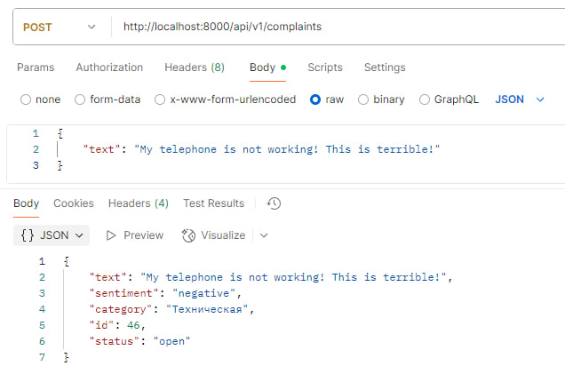
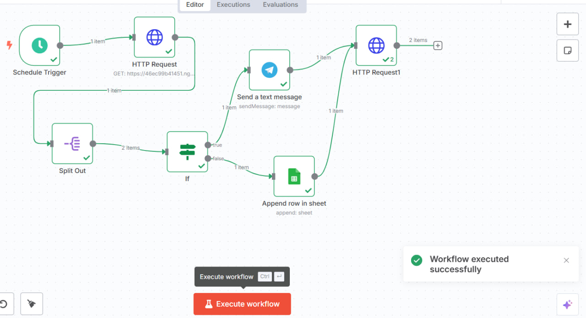
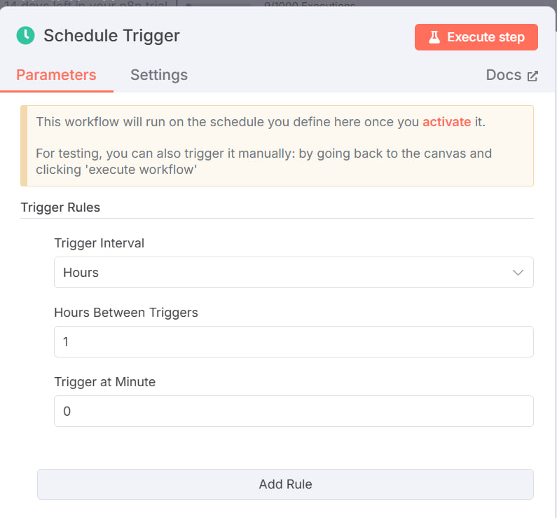
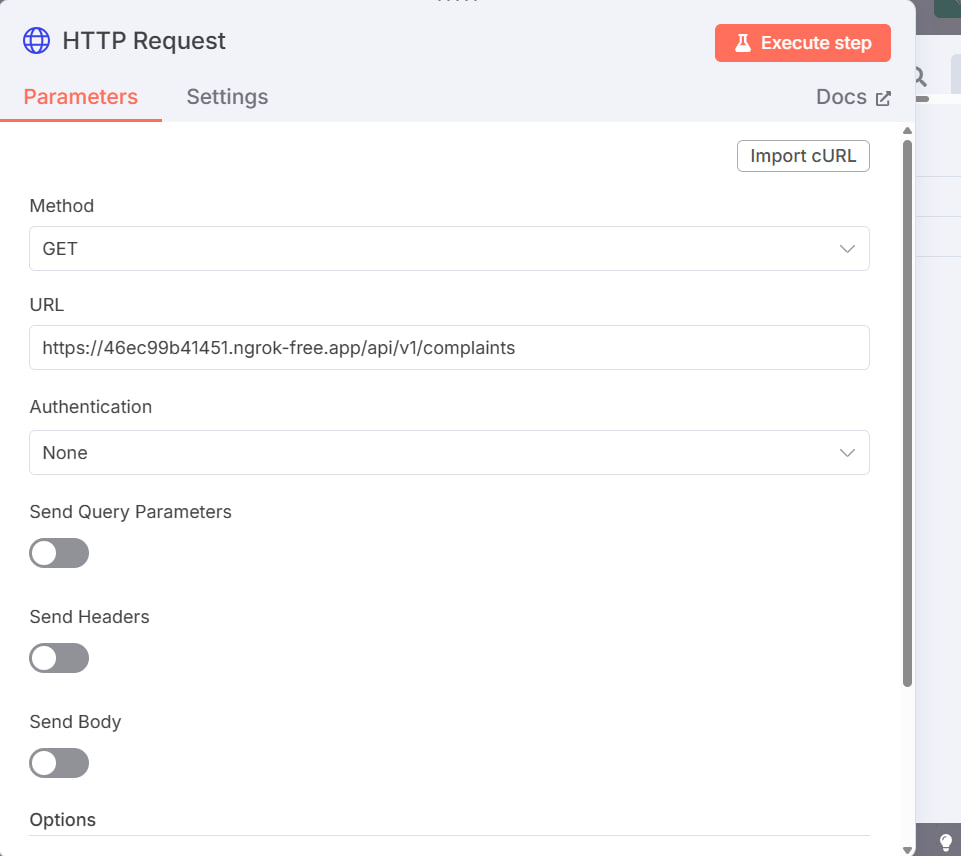
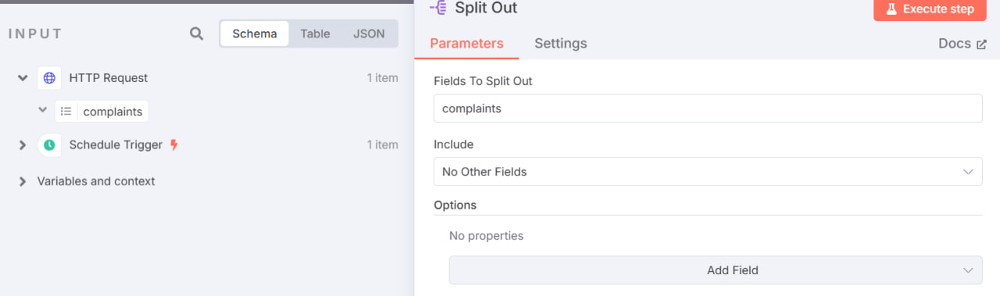
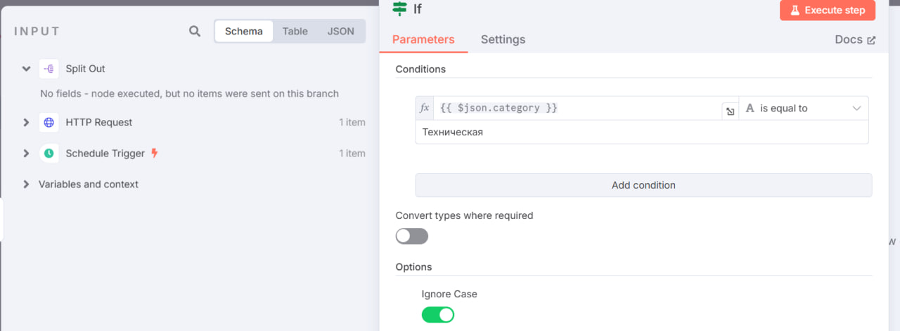
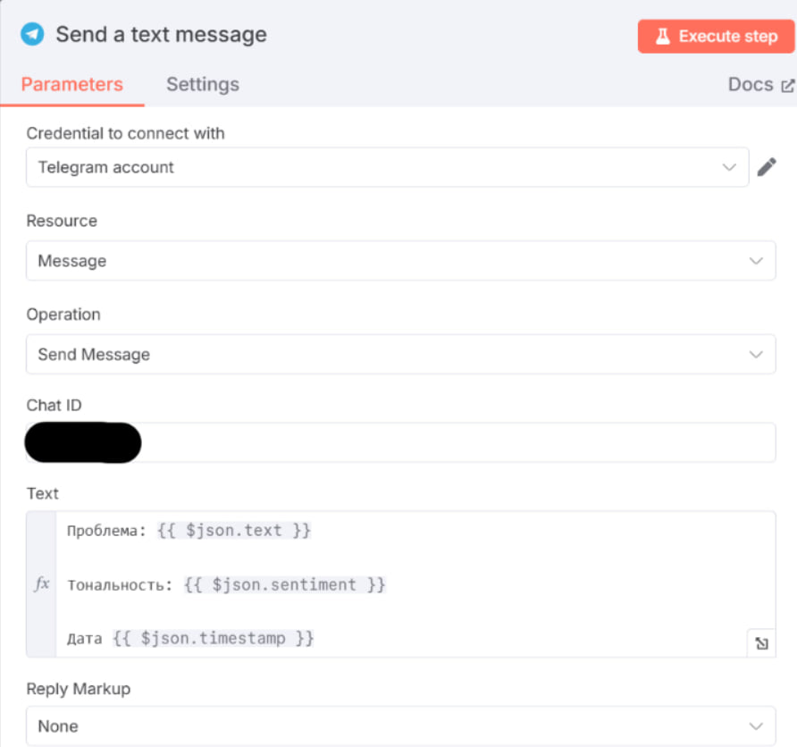
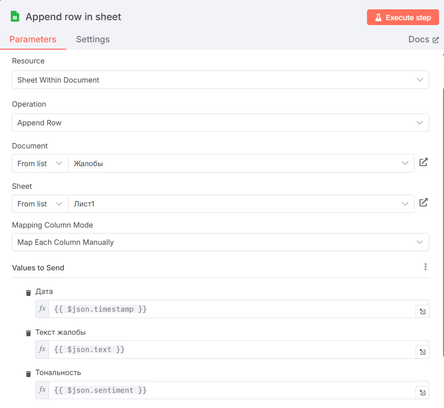
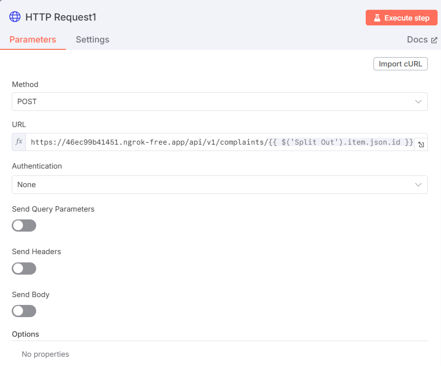

# Обработчик жалоб с пуш-уведомлениями в Telegram и Google Sheets

## Проект выполнен в рамках тестового задания 

### Функционал:
1) Чтобы отправить жалобу, нужно отправить POST-запрос на адрес http://localhost:8000/api/v1/complaints с телом запроса в формате JSON:
```json
{
  "text": "Текст жалобы"
}
```



2) После отправки жалобы произойдет оценка ее тональности с помощью API стороннего сервиса

3) Для определения категории жалобы используется AI-модель Mistral-7B

4) Каждый час сервис n8n делает запросы на backend и в зависимости от категории отправляет уведомления в Telegram или записывает новую строку в Google Sheets

### Установка
1) Клонируйте репозиторий:
```sh
git clone https://github.com/XXSnape/complaint-handler.git
```

2) Создайте виртуальное окружение и установите зависимости:
```sh
pip install -r requirements.txt
```

3) Создайте файл `.env` с вашими API-ключами, подобный .env_template:
- API_SENTINEL_KEY - [Ключ для сервиса тональности](https://apilayer.com/marketplace/sentiment-api)
- HF_TOKEN - [Ключ для AI-модели Hugging Face](https://huggingface.co/settings/tokens)

4) Примените миграции базы данных:
```sh
alembic upgrade head
```

5) Зарегистрируйтесь на [n8n.io](https://n8n.io/) и создайте workflow, который будет делать HTTP-запросы к вашему сервису. Для того, чтобы до вашего API возможно было достучаться извне, можно использовать сервисы вроде [ngrok](https://ngrok.com/)

6) Примеры настройки Nodes










7) Запустите сервер:
```sh
python backend/main.py
```